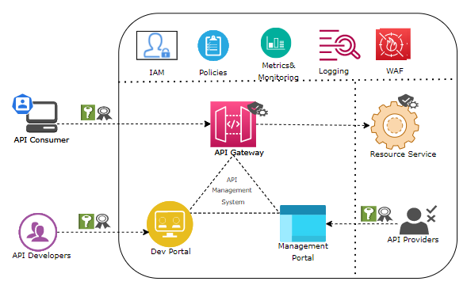
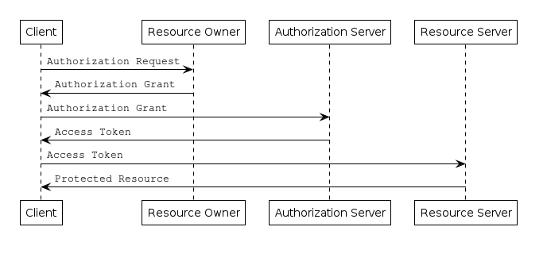
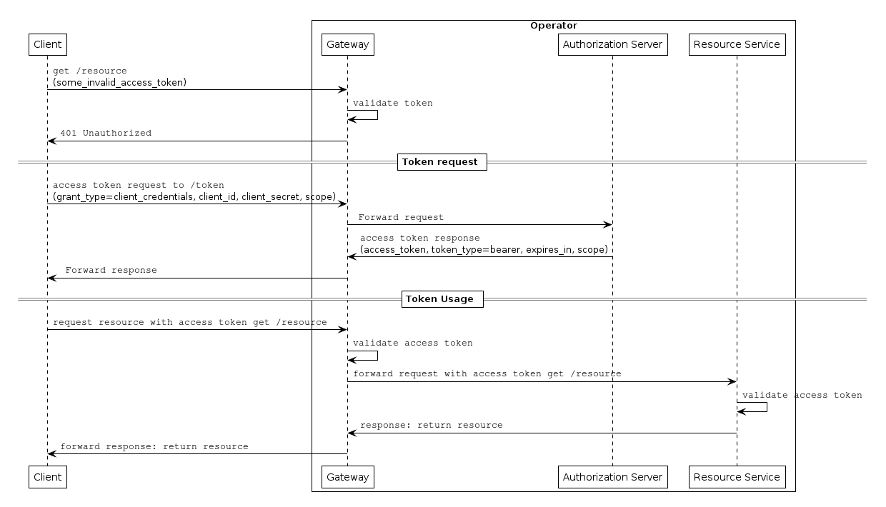
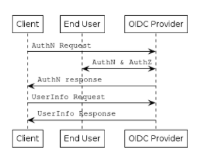
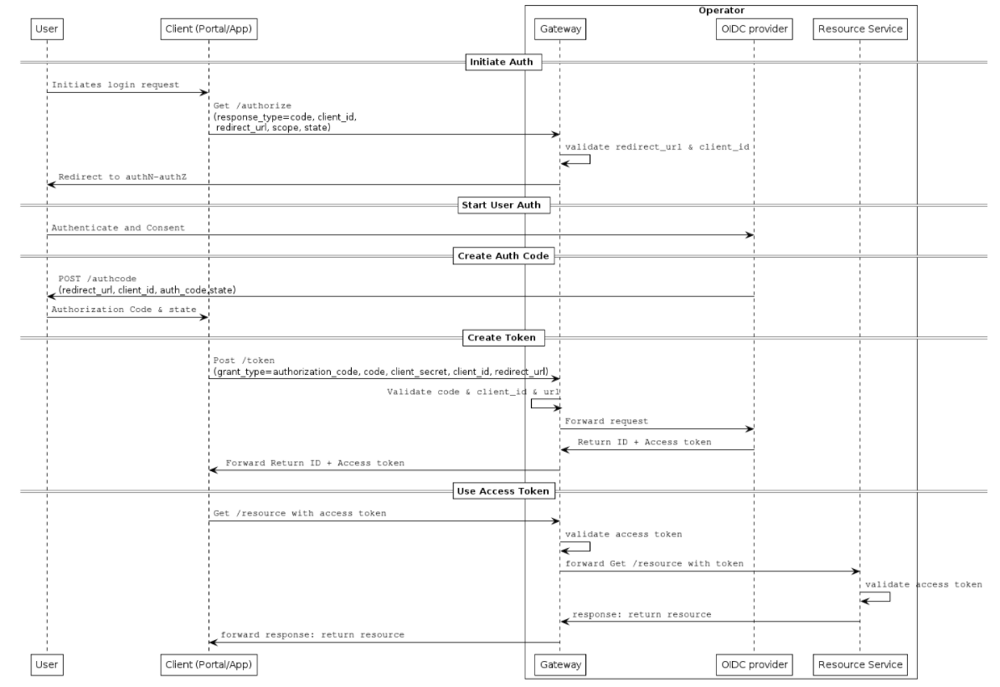

# Authentication and Authorization Concept for Service APIs
## Table of Contents
1. [Introduction](#Introduction)
2. [Difference between Authentication and Authorization](#Difference)
3. [API Gateway pattern](#Pattern)
4. [Authentication and Authorization details](#details)
   1. [OAuth2 with TLS](#oauth2)
   2. [OIDC](#oidc)
5. [Documentation and Specs](#docs)
6. [Summary](#Summary)
7. [References](#ref)

## Introduction <a name="Introduction"></a>

APIs are the most popular way of exposing business functions of an enterprise to the outside world and it digitally transforms a business. They are now the tool of choice for accessing data and functionality both inside of and between companies. However, this also comes with the risk of exploitation. API providers cannot assume “well behaved” users. API consumers may use the API to find weak points, overload the platform (DDOS) or may try to use brute force by cracking authentication/authorization.

This cannot be avoided by measures on consumer side. The API providers must be able to handle these scenarios and ensure that the services provided are reliable and secure by following zero trust security guidelines. Hence security with respect to API development cannot be an afterthought and must be part of the process from the very beginning.

Some of the infamous [1] API breaches over the past years show that the kind of authentication(AuthN) & authorization(AuthZ) implemented was not sufficient to prevent these breaches. The ForgeRock 2021 Breach Report reveals that attacks involving usernames and passwords increased a staggering 450% in 2020 from 2019, translating into more than 1 billion compromised records in the U.S. alone.

In this document we will not delve into all aspects of API security but rather focus on the authentication and authorization concept for the Service APIs.

## Difference between Authentication and Authorization <a name="Difference"></a>
Authentication [3] refers to the process of confirming identity. In authentication, a user or an application prove they are, who they say they are, by providing valid credentials for verification.
Authorization [2] refers to the process of verifying what a user has access to. While often used interchangeably with authentication, it represents a fundamentally different function. In authorization, a user or application is granted access to an API after the API determines the extent of the permissions that it should assign. Usually, authorization occurs after identity is successfully validated through authentication so that the API has some idea of what sort of access it should grant.

It is also important to reflect on a step before authentication (step 0) - onboarding. This is also referred to commonly as partner/consumer onboarding. 

### User indentity

On what refers to CAMARA APIs to be exposed by Telco operators, the end user is the human participant which is identified in Telco Operator by a unique user identifier (e.g. Subject identifier `sub` in OIDC terminology). Therefore, the Authentication process allows to confirm/validate user identity.

It is important to differentiate the identification of a user from the identification of a device or UE. For example, the same user could have multiple associated devices.  

## API Gateway pattern <a name="Pattern"></a>
An API implementation typically includes the business logic of the offered service. If the API includes all the security and exposure specific logic into an API, it will end up making the implementation too complex. The API gateway resides between the backend service (resource service) and the API consumer and it intercept all the requests from the consumer to the service. The API Management system integrates with an identity and access management system to ensure that all users accessing the system are authenticated and authorized to use the platform.

This pattern (together with an API management system) has other advantages:

- Helps to hide the complexity and diversity of your internal architectures
- Provides one stop place for API discovery
- Enables organization level policy enforcement and protects the backend services
- Accelerates API adoption rate
- Improves partner/developer onboarding timelines with self service capabilities  




## Authentication and Authorization details <a name="details"></a>
Basic Authentication was the first web authentication scheme (specification first published in 1999, see RFC7617 for the updated version). While its simplicity is an advantage (the browser handles the client-side logon), it has security downsides - password is sent in the request headers (in base64 encoding) for every request and can be cached/stored by the browser. 

Some APIs use API keys for authorization. An API key is a token that a client provides when making API calls. The key can be sent in the query string, as a request header or as a cookie. 

These simplistic methods cannot protect the API against today's sophisticated security attacks by bad actors.

There are several limitations to these methods:

- The username password at least needs to be shared between 2 parties.
- The stolen passwords and keys can be exploited by the attacker for significantly long period of time before it gets noticed  
- API keys might have no expiry
- Since API keys and passwords are part of the requests, they could be prone to man in the middle attacks

To address these vulnerabilities, the OAuth standard was introduced. 

### OAuth2 with TLS <a name="oauth2"></a>

OAuth2 (RFC6749)  is the industry-standard protocol framework for authorization (also known as an access delegation protocol). Over the years it has become the most popular authorization mechanism for APIs. (Any reference to OAuth in this document should be understood as OAuth2). The long list of providers is a testament to its widespread acceptance in the industry. OAuth2 relies on authentication scenarios called flows (or grant types), which allow the resource owner to share the protected content at the resource server without sharing their credentials.  OAuth2 is not about authentication but rather about delegation.The OAuth2 server issues access token which are used by the client applications to access protected resources on behalf of the resource owner. The protected resources need not know who the client application is but rather what permissions it has been delegated. The protected resource can validate this at its end. 

OAuth2 access tokens are issued to allow limited access to specific resources for a specified period of time and may be revoked by the user that granted permission, or by the server that issued the token. OAuth2 provides several flows suitable for different types of API clients. It mandates use of encryption (TLS ) to protect confidential resources. Though not explicitly specified, TLS is expected to be used for all API traffic.

Roles defined by OAuth2

- <ins>Resource owner</ins>: An entity capable of granting access to a protected resource. When the resource owner is a person, it is referred to as an end-user.
- <ins>Resource server</ins>: The server hosting the protected resources, capable of accepting and responding to protected resource requests using access tokens.
- <ins>Client</ins>: An application making protected resource requests on behalf of the resource owner and with its authorization. The term "client" does not imply any particular implementation characteristics (e.g., whether the application executes on a server, a desktop, or other devices).
- <ins>Authorization server</ins>: The server issuing access tokens to the client after successfully authenticating the resource owner and obtaining authorization.

Client Types defined by OAuth2

OAuth2 defines two client types, based on their ability to authenticate securely with the authorization server (i.e., ability to maintain the confidentiality of their client credentials):

- <ins>Confidential</ins>: Clients capable of maintaining the confidentiality of their credentials (e.g., client implemented on a secure server with restricted access to the client credentials), or capable of secure client authentication using other means. 
- <ins>Public</ins>: Clients incapable of maintaining the confidentiality of their credentials (e.g., clients executing on the device used by the resource owner, such as an installed native application or a web browser-based application), and incapable of secure client authentication via any other means.


Access tokens, ID tokens and refresh tokens

- <ins>Access Tokens</ins>: An access token represents the delegated permissions that the resource owner (the user) has given the client application. An access token could contain information about the user who delegated permission, but it does not actually represent the user. An access token also does not represent or give any indication of a user having authenticated. Access tokens should be signed and encoded as JWT (Json Web Token), with the bearer type specified.  As access token is intended for a protected resource, the protected resource should be responsible for understanding and validating the token.
- <ins>ID Tokens</ins>: An ID token contains the identity of the resource owner. It describes the authentication event that took place at the identity provider. It contains information such as how and when the user last authenticated. It is always signed and encoded as a JWT.
- <ins>Refresh tokens</ins>: A refresh token is used to reauthorize the granted access by allowing the client application to obtain an access token without the user credentials. The refresh token would be used when the previous access token expires and is no longer valid. An access token generally has a short lifespan to limit the damage that can be done if it were compromised. A refresh token helps improve the experience of the API consumers by not asking them for credentials on a too frequent basis.
Protocol Flow

Please note that the ID token mentioned above is not a part of Oauth2 specification. It is defined in the OpenID connect (OIDC) specification described later in the document.

<ins>Token Validations</ins>: Token introspection is elaborated in detail in RFC7662. Below are listed the standard checks that must be part of token validations:
- Signature of the token
- Expiry of the token (exp_claim)
- Issuer recognized as a trusted issuer (iss_claim)
- Consumer whitelisted in ACL list (azp_claim) 

For ID token, audience, time of token issue, nonce etc. should be included as a part of the validations. If any of the validation steps fail, the request must be denied with an appropriate error message.


<ins> Protocol Flow </ins>: An abstract protocol flow for OAuth2 is illustrated below:



Relevant Authorization grants

An authorization grant is a credential representing the resource owner's authorization (to access its protected resources) used by the client to obtain an access token. Out of the grants defined under OAuth2 we recommend:

- <ins>Client Credentials grant</ins>: (when user resource is NOT involved & the client belongs to confidential category)
- <ins>Authorization Code grant</ins>: (when user resource is involved)

Extensions
- <ins>Token exchange grant</ins>: (RFC8693) It is used when multiple participants are involved with impersonation (using subject_token) or/and delegation (actor_token) requirements and the existing grant options limit possible inputs/outputs
- <ins>Device code grant</ins>: (RFC8628) It is used when two separate devices are involved, one asking for authorization, and  the other device on which authorization is actually granted but it is input constrained
The implicit and password grant types are other options specified by OAuth2 when user resource is involved but they are already considered legacy.
- <ins>Bearer JWT grant (jwt-bearer)</ins>: (RFC7523) It is used to request an access token when a client wishes to utilize an existing trust relationship, expressed through the semantics of the JWT, without a direct user-approval step at the authorization server. It uses the "Assertion Framework for OAuth 2.0" (RFC7521) to define assertions (JWT) as authorization grants with OAuth 2.0.


#### Client Credential Grant
The client credential grant is used for server to server use cases involving trusted partners or clients without any protected user data involved. In this method the API invoker client is registered as a confidential client with an authorization grant type of client_credentials. 



### OIDC <a name="oidc"></a>
As already mentioned earlier OAuth2 is not authentication. OpenID Connect 1.0 (OIDC) is a standard from the OpenID Foundation that extends the OAuth2 protocol with a simple identity layer on top. It allows both protocols to work together, providing both Single Sign-On (SSO) and authorization to access APIs on the user’s behalf. OpenID Connect achieves this using identity tokens, and a new API - user info endpoint.

It enables Clients to verify the identity of the End-User based on the authentication performed by an OpenID provider, as well as to obtain a basic profile information about the End-User in an interoperable and REST-like manner. OIDC defines a sign-in flow that enables a client application to authenticate a user, and to obtain information (or "claims") about that user, such as the username, email, and so on. User identity information is encoded in an ID token.


	


#### Authorization code grant
The authorization code is a temporary code that the client will exchange for an access token. The code is obtained from the authorization server. The user gets to know about the information requested by the client and can then approve or deny the request. The application requesting for the access token must supplement the request with the client secret. This reduces the risk that the authorization code can be exploited if intercepted by a bad actor.


	

<ins>PKCE (security related Oauth2 extension)</ins>

Proof Key for Code Exchange (PKCE is specified in RFC 7636) is a kind of proof of possession. It is an extension to the authorization code flow to prevent CSRF and authorization code injection attacks. The technique involves the client first creating a secret on each authorization request, and then using that secret again when exchanging the authorization code for an access token. This way if the code is intercepted, it will not be useful since the token request relies on the initial secret. PKCE uses cryptography to guarantee that the client exchanging an OAuth2 code for tokens is the same client that started the original OAuth2 request. It is hence important to use this extension when using Auth code grant flow.

#### OIDC Client-Initiated Backchannel Authentication (CIBA) flow
CIBA is an authentication flow like regular OpenID Connect. However, unlike OpenID Connect, there is direct Relying Party to OpenID Provider communication without redirects through the user's browser. It decouples the concept of a Consumption Device (on which the user interacts with the Relying Party) and an Authentication Device (on which the user authenticates with the OpenID Provider and grants consent). CIBA allows a Relying Party that has an identifier for a user to obtain tokens from the OpenID Provider. The user starts the flow with the Relying Party at the Consumption Device, but authenticates and authorizes request on the Authentication Device. Authentication could even be initiated without user action on the consumption device.

## Documentation and Specs <a name="docs"></a>
Several developer surveys explain how important API documentation is to the success of an API. These surveys also highlight that missing or unclear documentation on authentication and authorization for an API can deter most consumers/developers to get started with the API. The API documentation template contributed within Camara alliance has already added the authentication section as mandatory to highlight its importance. 

The Camara APIs specs are contributed in OAS3 format [9]. This specification format natively supports specifying security schemes based on OAuth2 and OIDC which allows a standard way for Camara API contributors to define the scheme supported by their APIs.

The YAML OAS3 specification uses the securitySchemes and security keywords for describing security properties. SecuritySchemes are used to define all security schemes the API supports, and security is used to apply specific schemes to the whole API or individual operations. All security schemes used by the API must be defined in the global components/securiySchemes section.

The following example shows how OpenID Connect security schemes are defined:
```
openapi: 3.0.0
(...)
# Define the security scheme type and attributes
components:
  securitySchemes:
    openId:   # <--- Arbitrary name for the security scheme. Used to refer to it from elsewhere.
      type: openIdConnect
      openIdConnectUrl: https://example.com/.well-known/openid-configuration
# Apply security globally to all operations
security:
  - openId:   # <--- Use the same name as specified in securitySchemes
      - t_read
      - t_write
      - admin
```
The security section then applies the chosen security scheme to your API. The actual scopes required for API calls need to be listed here. These may be a subset of the scopes returned by the discovery endpoint. If different API operations require different scopes, security can be applied on the operation level instead of globally. This way relevant scopes for each operation can be listed:

```
    paths:
      /sessions/{sessionId}:
        get:
          summary: `Get session information`
          security:
            - openId:
              - t_read
          ...
        delete:
          summary: `Free  resources  related  to  QoS  session`
          security:
            - openId:
              - t_write
          ...
```

## Summary <a name="Summary"></a>

Security and reliability rank very high in an API world. The complexity of modern systems make it a must to integrate these aspects into the products from their inception. As mentioned earlier, these dimensions cannot be designed into the system as an afterthought. AuthN and AuthZ are two most prominant building blocks when designing a secure and reliable system. It is therefore critical to use industry tested and adopted frameworks when implementing these concepts.
Depending on the Service API use cases, we expect the APIs contributed to the Camara project use the above specified means of authentication and authorization frameworks to support interoperability and to offer a reliable and secure experience to our Camara API consumers.


## References <a name="ref"></a>
#### Open guides and specifications

[1]: https://auth0.com/docs/authentication "Authentication"  
[2]: https://auth0.com/docs/authorization "Authorization"  
[3]: https://swagger.io/docs/specification/authentication/ "Security schemes (Swagger OpenAPI Guide)"  
[4]: https://oauth.net/articles/authentication/ "OAuth authentication"  
[5]: https://github.com/OAI/OpenAPI-Specification/blob/main/versions/3.1.0.md#securitySchemeObject "Security Scheme Object"   
[6]: https://github.com/OAI/OpenAPI-Specification/blob/main/versions/3.1.0.md#securityRequirementObject  "Security Requirement Object"  
[7]: https://openid.net/specs/openid-connect-core-1_0.html "OpenID Connect Specification"  
[8]: https://openid.net/specs/openid-connect-discovery-1_0.html "OIDC Discovery Specification"  
[9]: https://spec.openapis.org/oas/v3.1.0 "OAS3"

[1] https://auth0.com/docs/authentication "Authentication"  
[2] https://auth0.com/docs/authorization "Authorization"  
[3] https://swagger.io/docs/specification/authentication/ "Security schemes (Swagger OpenAPI Guide)"  
[4] https://oauth.net/articles/authentication/ "OAuth authentication"  
[5] https://github.com/OAI/OpenAPI-Specification/blob/main/versions/3.1.0.md#securitySchemeObject "Security Scheme Object"   
[6] https://github.com/OAI/OpenAPI-Specification/blob/main/versions/3.1.0.md#securityRequirementObject  "Security Requirement Object"  
[7] https://openid.net/specs/openid-connect-core-1_0.html "OpenID Connect Specification"  
[8] https://openid.net/specs/openid-connect-discovery-1_0.html "OIDC Discovery Specification"  
[9] https://spec.openapis.org/oas/v3.1.0 "OAS3"


#### RFCs 
-   OAuth 2 Authorization Framework,  [RFC 6749](https://tools.ietf.org/html/rfc6749)
-   OAuth 2 Bearer Token Usage,  [RFC 6750](https://tools.ietf.org/html/rfc6750)
-   OAuth 2 Token Revokation,  [RFC 7009](https://tools.ietf.org/html/rfc7009)
-   OAuth 2 Token Introspection  [RFC 7662](https://tools.ietf.org/html/rfc7662)
-   JSON Web Algorithms (JWA),  [RFC 7518](https://tools.ietf.org/html/rfc7518)
-   JSON Web Signature (JWS),  [RFC 7515](https://tools.ietf.org/html/rfc7515)
-   JSON Web Token (JWT),  [RFC 7519](https://tools.ietf.org/html/rfc7519)
-   OAuth 2 Assertion,  [RFC 7521](https://tools.ietf.org/html/rfc7521)
-   OAuth 2 Token Introspection [RFC 7662](https://datatracker.ietf.org/doc/html/rfc7662)
-   OAuth 2 Security Assertion Markup Language,  [RFC 7522](https://tools.ietf.org/html/rfc7522)
-   JSON Web Token Bearer,  [RFC 7523](https://tools.ietf.org/html/rfc7523)

## CAPIF <a name="CAPIF"></a>

In 3GPP there are multiple northbound API-related specifications. To avoid duplication and inconsistency of approaches between different API specifications and to specify common services (e.g., authorization), 3GPP has developed the common API Reference framework (CAPIF) https://www.3gpp.org/common-api-framework-capif that includes common aspects applicable to any northbound service APIs. We highlight below some of the terms that are relevant from the authentication and authorization perspective.

<ins>CAPIF Core</ins>: The CAPIF core function includes:

- Authenticating the API invoker based on the identity and other information required for authentication of the API invoker
- Supporting mutual authentication with the API invoker
- Providing authorization for the API invoker prior to accessing the service API
- Onboarding a new API invoker and offboarding an existing API invoker
- Storing policy configurations related to CAPIF and service APIs
- Based on the above listed functionalities we use the word API Gateway and Capif Core interchangeably within this document. The gateway integrates with an identity provider (IdP) to fulfill the scope of functionalities listed above. 

<ins>API Exposing Function (AEF)</ins>: AEF includes:

- Validating the authorization provided by the CAPIF core function.

Functionalities listed for the AEF should be common capabilities used by the Service APIs which follow the zero-trust security approach. This ensures that security aspects are not ignored even in a trusted domain and that needed validations are done at every level, not just at the perimeter. It is also considered a best practice to not include identity, roles, and permissions as a part of a single system. Permissions are very much domain and application specific. This should be handled by a separate RBAC (Role based access control) system which the AEF can refer to for its validations. In case the user data is involved, AEF can also expect the profile information to be made available to it as custom attributes of the user info endpoint after the authentication process.

<ins>API Invoker</ins>: The API invoker is typically provided by a 3rd party application provider who has service agreement with PLMN operator. The API invoker supports the following capabilities: 

- Support the authentication by providing the API invoker identity and other information required for authentication of the API invoker
- Obtaining the authorization prior to accessing the service API

We will use the term "API consumer" and "API invoker" interchangeably in this document.

Please note that we have only listed the capabilities and roles of the CAPIF entities which are relevant from the authentication and authorization perspective.


## API Gateway pattern and Capif overlap <a name="overlap"></a>
A recap from the gateway pattern: An API implementation typically includes the business logic of the offered service. If the API includes all the security and exposure specific logic into an API, it will end up making the implementation too complex.

In CAPIF terms these responsibilities are offloaded to the CAPIF Core and the AEF. The gateway resides between the backend service (resource service) and the API consumer and it intercept all the requests from the consumer to the service. However, with zero-trust security approach, it is equally important that even the backend services participate in the needed security validations. This capability is identified within CAPIF and is represented by AEF.

Both the CAPIF core and the AEF participate in critical validations that help ensure that the backend services are protected from unauthenticated/unauthorized actors. 
