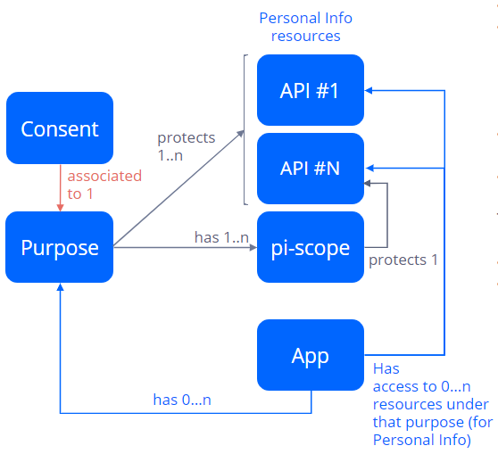
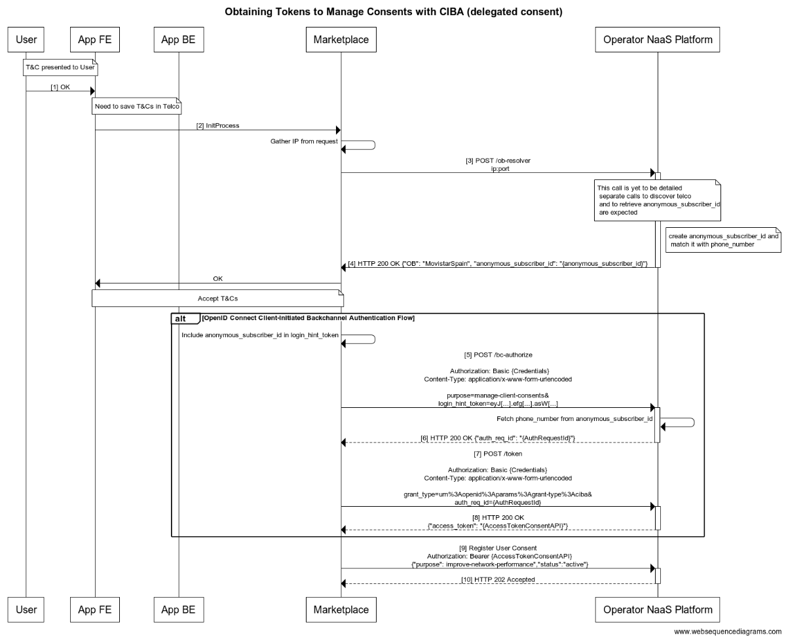
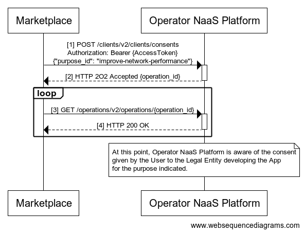
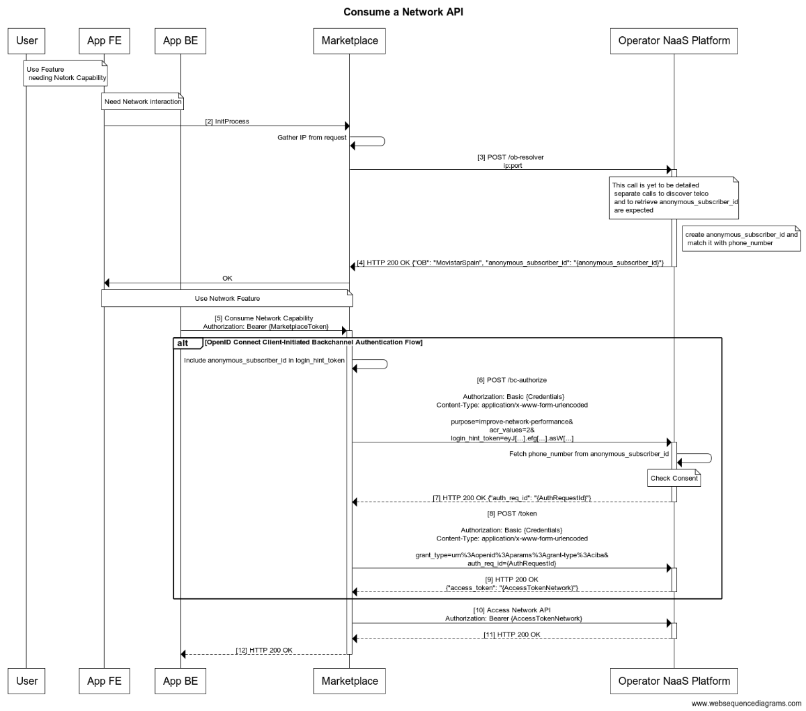

# User Consent Management

This document captures guidelines for Operator NaaS platform to handle user consents.

## Table of Contents

  - [Introduction](#introduction)
  - [Glossary of Terms and Concepts](#glossary-of-terms-and-concepts)
  - [Purposes](#purposes)
    - [Purpose levels](#purpose-levels)
    - [Purpose relationship with other key concepts](#purpose-relationship-with-other-key-concepts)
  - [Using purpose parameter in the authorization request](#using-purpose-parameter-in-the-authorization-request)
  - [Obtaining an access token to manage user consent](#obtaining-an-access-token-to-manage-user-consent)
    - [Register user consent](#register-user-consent)
  - [Obtaining an access token to consume Network APIs](#obtaining-an-access-token-to-consume-network-apis)
  - [Consent API and Consent Config API](#consent-api-and-consent-config-api)
  - [Annex: Flow source code](#annex-flow-source-code)
    - [Obtaining access token to manage user consent flow](#obtaining-an-access-token-to-manage-user-consent-flow)
    - [Register user consent flow](#register-user-consent-flow)
    - [Obtaining access token to consume Network APIs flow](#obtaining-an-access-token-to-consume-network-apis-flow)


## Introduction

Operator NaaS platform implementing CAMARA should be built with a privacy-by-default approach to fully comply with data protection regulations like the [GDPR regulation](https://gdpr-info.eu/) in Europe, which provides a great level of protection for user's privacy. This means that an API that processes Personal Information needs a user consent. Consents are given by users to legal entities to process personal data under a specific purpose.

This document captures guidelines for Operator NaaS platform to handle user consents to comply with GDPR or equivalent requirements in an easy way, introducing the concept of purpose in OpenID Connect. Even being defined based on concepts that maps to GDPR regulation, proposed solution and concepts are generic enough to be used by Operators on any country.

These User consent management guidelines define a procedure for application back-ends to obtain access tokens for purposes which require user consent. It relies on the standard [OpenID Connect Client-Initiated Backchannel Authentication (CIBA) Flow](https://openid.net/specs/openid-client-initiated-backchannel-authentication-core-1_0.html). OpenID Connect (OIDC) is an identity layer built on top of the OAuth 2.0 framework which is the industry-standard protocol framework for authorization.

Operator Auth server will not manage the user consent during authorization process. Consent gathering from users is a one-off independent process that must be completed before the actual access to the protected resource (e.g. CAMARA API). 

The above also allows Operator NaaS platform to have consent control centralized in a third party instead of being done in Auth Server. Auth Server will check if the user has provided the consent to the purposes requested before issuing an access token.

## Glossary of Terms and Concepts

The list below introduces several key concepts:

-	`NaaS`: Network-as-a-Service model where Telco Network capabilities are exposed to third parties through APIs. And some of those APIs are likely to require user consent to be accessed. 
-	`Application`: client system that requires access to protected resources. Application must use the appropriate access token to access those resources (e.g. CAMARA Network APIs).
-	`User`: the human participant which is identified in Telco Operator by a unique user identifier (e.g. Subject identifier sub in OpenID Connect terminology). The user is the resource owner.
-	`Auth Server`: authorization server which receives requests from applications to issue an access token upon successful authentication and consent of the user. The OpenID Connect Provider is able to authenticate the user validating user identity against the corresponding Identity Provider. The authorization server exposes two endpoints: the Authorization endpoint and the Token endpoint.
-	`Identity Provider (IdP)`: It corresponds to the OpenID identity provider which is the party that provides user authentication as a service (it creates, maintains, and manages user identity information). 
-	`Resource Server`: A server that protects the user resources and receives access requests from applications. It accepts and validates an Access Token from the application and returns the appropriate resources to it.
-	`Scope`: OpenID Connect scope name which maps one or more resources. Some scopes may refer to Personal Information that could be affected by data protection regulations that require identifying the purpose for which they are requested.
-	`Data processing`: storing, transforming, or accessing Personal Information is considered processing data. Third party clients will be data processors, while the telco operator will be the data controller.
-	`Purpose`: The reason for which processing that Personal Information is required by the application. For example, an application might want to handle Personal Information to create a movie recommendation for a user. This is equivalent to the term Purpose mentioned in GDPR law; for example, [Art. 5 of the law](https://gdpr-info.eu/art-5-gdpr/) states the following: “Personal data shall be […] collected for specified, explicit and legitimate **purposes**”. Additionally, personal data is translated into Personal Information resources, as explained below.
-	`Personal Information Scope`: Also known as PI scopes, these are scopes that refer to resources providing access to Personal Information and thus requiring special protection. **Getting access to PI scopes must always be done by explicitly declaring a purpose**. Therefore, a Purpose maps to a predefined set of PI scopes, giving access to Personal Information processing.
-	`Consent`: an explicit opt-in action that the user takes to allow processing of their Personal Information. Consent can be a signature on a paper, a voice recording or clicking on an authorize button on a website. And it grants a **legal** entity (e.g., the operator or a specific third party) access to a set of **scopes** of a given **user**, under a specific **purpose**.
-	`Legal Entities`: are the legal subjects that are willing to get access to personal information with a specific, predefined purpose.

## Purposes

A purpose declares what the application intends to do with a set of Personal Information resources. It provides a human-friendly description of why the data processing takes place and a list of the scopes of that Personal Information that gives access to its processing.

```json
[
  {
    "id": "create-invoice",
    "title": "Create an invoice",
    "description": "Creation of monthly invoice",
    "level": "legitimate_interest",
    "pi_scopes": ["cdr-read", "subscribed-products-read"]
  },
  {
    "id": "create-credit-score",
    "title": "Credit score",
    "description": "Calculate a credit score for the user",
    "level": "consent",
    "pi_scopes": ["invoice-read"]
  },
  {
    "id": "digital-invoice",
    "title": "Digital Invoice",
    "description": "Send invoice by email",
    "level": "contract",
    "pi_scopes": ["invoice-read"]
  },
  {
    "id": "improve-network-performance",
    "title": "Improve Network Performance",
    "description": "Network performance improvement by QoS control",
    "level": "terms_and_conditions",
    "purpose_type": "identifier-bound",
    "pi_scopes": ["qod-session-write"]
  }
]
```
Purposes can be grouped into three categories: 

- **Automatic purpose** : This purpose does not require explicit consent from the user and cannot be revoked. For example, you need to handle call logs to create an invoice.
- **Opt-out purpose** : This purpose does not require explicit consent from the user, but consent can be revoked. For example, processing invoices to improve our commercial offering and for marketing purposes.
- **Opt-in purpose** : This purpose requires explicit user consent and can be revoked. For example, creating a credit score for a user based on CDRs and payment history.

Moreover, when it comes to granting consent, there are two types of the purposes:

-	**User-bound**: the consent is granted to be applied for all the identifiers of a given user i.e. granted at user level. For example, grant consent for accessing to the call history of any of her phone numbers. 
-	**Identifier-bound**: the consent is granted to be applied only for a specific user’s identifier i.e. for a public identifier associated with the service the Telco Operator provides to the user (typically a phone number). For example, grant consent for accessing to the call history of only one of her phone numbers.

### Purpose levels

Depending on the purpose categories the purpose may have a specific level that determines the processing allowed by the user if the purpose is granted. **User consent is required to gain access to non-automatic purposes**.

| **Purpose Level** | Description | Category |
| --- | --- | --- |
|`legal_obligation` | A process that is required by law. | Automatic purpose |
|`contract` | A process that is needed to fulfill the service contract with the user, and it is already approved when the contract was signed. | Automatic purpose |
|`legitimate_interest`| An interest of the data processor that does not conflict with the fundamental interest of the individuals. | Opt-out purpose |
|`compatible` | A re-processing of data acquired through another purpose that is compatible with the first purpose. | Opt-out purpose|
|`consent` | This level applies to purposes which are unrelated enough to the service. | Opt-in purpose|
|`terms_and_conditions`| The operations or tasks done by an application to provide its functionality, as described in the Terms and Conditions. | Opt-in purpose|


> _NOTE: This list of levels MAY be extended with new values. The OpenID Provider (Auth Server) and the APIs used by the Relying Parties (client Applications) MUST be ready to support new values in the future._

### Purpose relationship with other key concepts

The key concepts defined to handle user personal information are related to purpose concept in the following way:



- Scopes tell what resources (e.g. APIs) are accessible under those scopes.
- A purpose has associated a set of personal information scopes (PI scopes). 
  - These are scopes that refer to resources providing access to Personal Information and thus requiring special protection as stated by e.g. the GDPR law.
  - Getting access to PI scopes MUST always be done by explicitly declaring a purpose.
- Scopes are assigned to an application, granting access to APIs and other resources.
- Purposes are assigned to an application.


Therefore, an application will have access to:
  - APIs or resources covered by the assigned scopes
  - APIs or resources providing personal information under the assigned purpose (because of the PI scopes included in that purpose)
    - **Only** if user has granted her consent for that purpose
    - Which may happen automatically (automatic purposes) or may need an explicit user action to provide consent (depending on the purpose level of the purpose associated to that consent). In the second case, the consent is created and stored and will be validated during authorization.

## Using purpose parameter in the authorization request

The application can request a list of purposes in the authorization request of the [OAuth 2.0 Authorization Framework](https://www.rfc-editor.org/rfc/rfc6749) using an additional `purpose` parameter:

| **Authorize request param** | Description |
| --- | --- |
| `purpose` | The value of this parameter is expressed as a list of space-delimited, case-sensitive strings. The strings will be the id of the purposes. |

This parameter has been defined in these guidelines to allow applications to provide a purpose/s name which represents the reason why a client application needs to process a certain piece of user Personal Information. Note that, as explained before, a purpose maps to a list of scopes giving access to Personal Information resources.

_Example: requesting "purpose\_1", "purpose\_2" and "purpose\_3"_

```
POST /bc-authorize HTTP/1.1
Authorization: Basic {Credentials}
Content-Type: application/x-www-form-urlencoded

purpose=purpose_1%20purpose_2%20purpose_3&
login_hint_token=eyJ[…].efg[…].asW[…]&
… 
```

The access token obtained from Token Endpoint will be granted to a subset or to all the scopes included in the requested purposes. The authorization server MAY fully or partially ignore the scopes of the requested purposes based on the authorization server policy. The authorization server MUST include the obtained scope list in the `scope` response parameter of the Token Endpoint to inform the client of the actual scopes granted.

The authorization server MUST include the obtained purpose list in the `purpose` response parameter of the Token Endpoint. The purpose MUST only be included in the response if at least one scope of the purpose has been granted.

_Example: only scopes of the "purpose\_1" and "purpose\_2" have been granted_

```
POST /token HTTP/1.1
Authorization: Basic {Credentials}
Content-Type: application/x-www-form-urlencoded

grant_type=urn%3Aopenid%3Aparams%3Agrant-type%3Aciba&
auth_req_id=1c266114-a1be-4252-8ad1-04986c5b9ac1

HTTP/1.1 200 OK
Content-Type: application/json;charset=UTF-8

{
  "access_token":"2YotnFZFEjr1zCsicMWpAA",
  "token_type":" Bearer",
  "expires_in":3600,
  "scope":"scope_1_of_purpose_1 scope_2_of_purpose_1 scope_1_of_purpose_2",
  "purpose":"purpose_1 purpose_2"
  …
}
```
The authorization endpoint still MUST support the `scope` parameter of the OAuth 2.0 specification. For example, to request an ID token or refresh token using OpenID Connect standard scopes or to request scopes not associated to Personal Information.

The application can request the Authorization endpoint using both parameters (`scope` and `purpose`), or one of them.

PI scopes cannot be requested using `scope` parameter. As stated before in this document, getting access to PI scopes must always be done by explicitly declaring a purpose. If a PI scope is requested by using the `scope` parameter, it will be ignored and removed from the request in Auth Server.

The authorization server MUST include all the obtained scopes and PI scopes in the `scope` response field of the Token Endpoint Request, the obtained scopes of the purposes and the obtained scopes of the `scope` parameter.

## Obtaining an access token to manage user consent

The process follows a standard mechanism based on the **OpenID Connect Client-Initiated Backchannel Authentication (CIBA) Flow. As explained below, the process is based in Telco feature of being able to identify the user based on the IP and port (needed to solve NAT scenarios in mobile networks)**.

This flow allows authentication process with a seamless user interaction (Just 1 click within the App FE. Neither the end-user is redirected to CSP channels nor CSP user and password are required). 

It involves direct communication from the Marketplace with Operator NaaS platform.



The user should be presented with the Terms & Conditions (T&C) required to use a set of network capabilities and accept them. The method by which the Marketplace and App exchange information and the way they interact between them is out of the scope of the present document.  
> _NOTE: Not shown in the flow, but the specific text can be retrieved as well from Operator NaaS Platform._

First, the `phone_number` of the user in the device, must be authenticated. This is done in steps 2 to 4, where: 
-	App FE must send a request to the marketplace. The marketplace will gather the IP and port of the device. Notice it is important that the request is coming from FE, so IP can be gathered. 
  -	In IoT scenarios (or scenarios involving devices without screen) but with a user experience in another device with screen (where the FE app is shown) the marketplace will gather the IP from the IoT device and not from the device with the screen. 
-	Then, marketplace will consume an API, sending the gathered IP, with a double goal: 
  -	Discover the Telco operator of the `phone_number` in the device. 
  -	Retrieve an `anonymous_subscriber_id` needed to later obtain a valid Access Token related to user and `phone_number` of the device. 
-	Operator NaaS Platform will retrieve the `phone_number` from the IP and port, and relate them to an anonymous_subscriber_id. 
-	This `anonymous_subscriber_id` will be received by the marketplace, to be used in later steps.

Then, the Marketplace sends an authentication request to Operator NaaS Platform by building an "HTTP POST" request containing all the information needed to authenticate the user (step 5): 
  - `purpose`: manage-client-consents 
  -	`login_hint_token`: A signed JWT token containing information to identify the end-user. A JWT example looks like: 
```json
{  
  "aud": "https://auth.example.baikalplatform.com/", 
  "iss": "https://marketplace-issuer", 
  "exp": 1504807731,  
  "iat": 1504804131, 
  "identifier_type": "anonymous_subscriber_id",  
  "identifier": "b3bfad3f-d6ab-495d-8b13-b5ac28d5ca60" 
}
```
The purpose is one defined to enable access to Consent API, i.e.: to register user consent.  

The values for the strings in the `identifier_type` claim would be `anonymous_subscriber_id`. 

If the authentication request is valid, Operator NaaS Platform will return an HTTP 200 OK response to the Marketplace accepting the request and returning an object with an identifier (`auth_request_id`) in the response body (step 6). 

Then the Marketplace polls the token endpoint by making an "HTTP POST" request by sending the grant_type (`urn:openid:params:grant-type:ciba`) and `auth_req_id` parameters (step 7). 

Given the match of `anonymous_subscriber_id` with a `phone_number` was done in former step, the process was completed, so first poll will return a HTTP 200 OK response to the Marketplace with an access token in the response body (step 8).  

The Marketplace will pair the operator’s user and access token with the user of the App.  

Last step in the flow is the actual registration of the consent, which is explained with some more detail in following section. 
> _NOTE: eventually, the Markeplace may prefer to query for the existence of the user consent and, if it does not exist, register it. If that’s the case, query can be done with same token obtained in step 8_. 

### Register user consent

The consent only needs to be registered once. **Operator NaaS platform must expose a simple Consent API** to register, list, or revoke user consents.



The expected body would be as follows:

```json
{ 
    "purpose_id": "improve-network-performance", 
    "channel": "marketplace-id" 
}
``` 
> _NOTE: Value of channel will be defined by Operator NaaS Platform._

It returns a HTTP 202 (Accepted) with an `operation_id` that can be used to poll until the operation finishes. 

Remind that **you need to provide an access token** to call the Consents API as indicated in former section. This means that you need to authenticate the user to know their identity before registering his/her consent.

## Obtaining an access token to consume Network APIs

Once user consent has been registered, everything should be ready to consume the Network API under the corresponding purpose. E.g.: _CAMARA API that allows to enhance the quality of service (QoS) of a mobile connection. The mobile connection is associated to the customer MSISDN, so acting on the connection requires to gather user consent for the app e.g.: Fortnite" (legal entity "Epic Games") to access the API under a purpose such as “improve network performance in your mobile connection to provide a better experience”_.

The API call must be done on behalf of the user/app that granted consent. Therefore, the proposed solution is to use same OpenID Connect CIBA flow (grant_type `urn:openid:params:grant-type:ciba`) explained before, but now to obtain an access token to consume a Network API. 

All calls must be done from the application backend for security reasons.



First part of the flow is exactly the same as in the previous section. The marketplace will discover the operator and will retrieve an `anonymous_subscriber_id`.

When this is completed, same CIBA flow as in former section is performed, as follows: 

The Marketplace sends an authentication to Operator NaaS Platform by building an "HTTP POST" request containing all the information needed to authenticate the user (step 5): 
-	`acr_values`: the acr values that the IdP is going to use for processing the authentication request. 
-	`purpose`: list of purposes to consume the API (e.g. `improve-network-performance`). 
-	`login_hint_token`: A signed JWT token containing information to identify the end-user. A JWT example looks like: 
```json
{  
  "aud": "https://auth.example.baikalplatform.com/",  
  "iss": "https://marketplace-issuer",  
  "exp": 1504807731,  
  "iat": 1504804131, 
  "identifier_type": "anonymous_subscriber_id",  
  "identifier": "b3bfad3f-d6ab-495d-8b13-b5ac28d5ca60" 
} 
```

The values for the strings in the `identifier_type` claim would be `anonymous_subscriber_id`. 

If the authentication request is valid (the user accepted the Terms & Conditions required for the purposes to consume - this check is described in the flow as Check Consent), Operator NaaS platform will return an HTTP 200 OK response to the Marketplace accepting the request and returning an object with an identifier (`auth_request_id`) in the response body (step 6). 

Then the Marketplace polls the token endpoint by making an "HTTP POST" request by sending the grant_type (`urn:openid:params:grant-type:ciba`) and `auth_req_id` parameters (step 7). 
Because the user accepted the Terms and Conditions previously, the authorization/authentication was completed, and it will return a HTTP 200 OK response to the Marketplace with an access token in the response body (step 8). 

Now the Marketplace has a valid Access Token that can be used to invoke the network API.

## Consent API and Consent Config API

As described in previous sections, an Operator NaaS Platform shall be built following a privacy-by-default approach, which guarantees an application or service can only access or modify the personal information it has permission to. This means that every time an application wants to use an API containing personal information, the platform checks automatically the purpose, the purpose level, and the user consent. But this way of working requires to implement a Consent API.

**Consent API** is required for two main reasons:

1.	A third-party can register the consent gathered from a user for a specific purpose which grants access to user personal information associated to some specific scope/s. Consent is collected by a third-party and not directly managed in auth server.
2.	The auth server can validate during delegated authorization process if there is user consent (opt-in) registered for the user and the requested purpose/s as pre-requisite to issue an access token.
 
Operator NaaS platform MUST define **Consent API** to meet the requirement where user consents are gathered and managed by a third-party element and not by Auth server itself.      

The API allows an application back-end to perform the following actions on behalf of a specific user:

•	Find if it has the consent to fulfill a certain purpose.
•	Create a consent
•	Revoke a consent
•	Simply inform that the consent was prompted to the user but he did not accept it.

But there is another API that may be required by third parties, called **Consent Config API**. This API would be intended for the management and provision of purposes, legal entities, and PI scopes. In order to request access to Personal Information under certain purpose, that purpose must be previously provisioned (see example in [Purposes](#purposes) section), and the PI scopes associated properly defined. In the same way, user consent is created for the legal entity associated to the client application and those legal entities must be also provisioned.

## Annex: Flow source code

### Obtaining an access token to manage user consent flow

```
title Obtaining Tokens to Manage Consents with CIBA (delegated consent)
  
participant User as User   
participant App FE as FE      
participant App BE as BE    
participant "Marketplace" as MP     
participant "Operator NaaS Platform" as ONP    
  note over User, FE: T&C presented to User     
  User -> FE: [1] OK    
  note over FE,BE: Need to save T&Cs in Telco  
  FE -> MP: [2] InitProcess  
  MP -> MP: Gather IP from request  
  MP ->+ ONP: [3] POST /ob-resolver \n ip:port 
  note over ONP: This call is yet to be detailed\n separate calls to discover telco\n and to retrieve anonymous_subscriber_id\n are expected 
  note right of ONP: create anonymous_subscriber_id and\n match it with phone_number  
  ONP ->-MP: [4] HTTP 200 OK {"OB": "MovistarSpain", "anonymous_subscriber_id": "{anonymous_subscriber_id}"}    
  MP -> FE: OK  
  note over FE,MP: Accept T&Cs  
alt OpenID Connect Client-Initiated Backchannel Authentication Flow    
  MP->MP: Include anonymous_subscriber_id in login_hint_token  
  MP->+ONP: [5] POST /bc-authorize\n\n Authorization: Basic {Credentials}\nContent-Type: application/x-www-form-urlencoded\n\npurpose=manage-client-consents&\nlogin_hint_token=eyJ[...].efg[...].asW[...]    
  ONP->ONP: Fetch phone_number from anonymous_subscriber_id  
  ONP-->-MP: [6] HTTP 200 OK {"auth_req_id": "{AuthRequestId}"}    
  MP->+ONP: [7] POST /token \n\nAuthorization: Basic {Credentials}\nContent-Type: application/x-www-form-urlencoded\n\ngrant_type=urn%3Aopenid%3Aparams%3Agrant-type%3Aciba&\nauth_req_id={AuthRequestId}    
  ONP-->-MP: [8] HTTP 200 OK \n{"access_token": "{AccessTokenConsentAPI}"}  
end  
MP->+ONP: [9] Register User Consent \n Authorization: Bearer {AccessTokenConsentAPI} \n {"purpose": improve-network-performance","status":"active"}  
ONP-->-MP: [10] HTTP 202 Accepted
```

### Register user consent flow
```
participant Marketplace as MP    
participant "Operator NaaS Platform" as ONP   
  
MP -> +ONP: [1] POST /clients/v2/clients/consents\nAuthorization: Bearer {AccessToken}\n{"purpose_id": "improve-network-performance"}   
ONP --> -MP: [2] HTTP 2O2 Accepted {operation_id}   
loop   
  MP -> +ONP: [3] GET /operations/v2/operations/{operation_id}   
  ONP --> -MP: [4] HTTP 200 OK   
end   
note over ONP: At this point, Operator NaaS Platform is aware of the consent\ngiven by the User to the Legal Entity developing the App\nfor the purpose indicated.
```

### Obtaining an access token to consume Network APIs flow
```
title Consume a Network API 
   
participant User as User   
participant App FE as FE      
participant App BE as BE    
participant Marketplace as MP    
participant Operator NaaS Platform as ONP    
  
note over User, FE: Use Feature\n needing Netork Capability  
  note over FE,BE: Need Network interaction  
  FE -> MP: [2] InitProcess  
  MP -> MP: Gather IP from request  
  MP ->+ ONP: [3] POST /ob-resolver \n ip:port 
  note over ONP: This call is yet to be detailed\n separate calls to discover telco\n and to retrieve anonymous_subscriber_id\n are expected 
  note right of ONP: create anonymous_subscriber_id and\n match it with phone_number  
  ONP ->-MP: [4] HTTP 200 OK {"OB": "MovistarSpain", "anonymous_subscriber_id": "{anonymous_subscriber_id}"}    
  MP -> FE: OK  
  note over FE,MP: Use Network Feature  
BE->+MP: [5] Consume Network Capability \n Authorization: Bearer {MarketplaceToken}    
  
alt OpenID Connect Client-Initiated Backchannel Authentication Flow    
  MP->MP: Include anonymous_subscriber_id in login_hint_token  
  MP->+ONP: [6] POST /bc-authorize\n\n Authorization: Basic {Credentials}\nContent-Type: application/x-www-form-urlencoded\n\npurpose=improve-network-performance&\nacr_values=2&\nlogin_hint_token=eyJ[...].efg[...].asW[...]    
  ONP->ONP: Fetch phone_number from anonymous_subscriber_id  
  note over ONP: Check Consent    
  ONP-->-MP: [7] HTTP 200 OK {"auth_req_id": "{AuthRequestId}"}    
  MP->+ONP: [8] POST /token \n\nAuthorization: Basic {Credentials}\nContent-Type: application/x-www-form-urlencoded\n\ngrant_type=urn%3Aopenid%3Aparams%3Agrant-type%3Aciba&\nauth_req_id={AuthRequestId}    
  ONP-->-MP: [9] HTTP 200 OK \n{"access_token": "{AccessTokenNetwork}"}    
end    
  
MP->+ONP: [10] Access Network API \n Authorization: Bearer {AccessTokenNetwork}    
ONP-->-MP: [11] HTTP 200 OK    
MP-->-BE: [12] HTTP 200 OK
```
